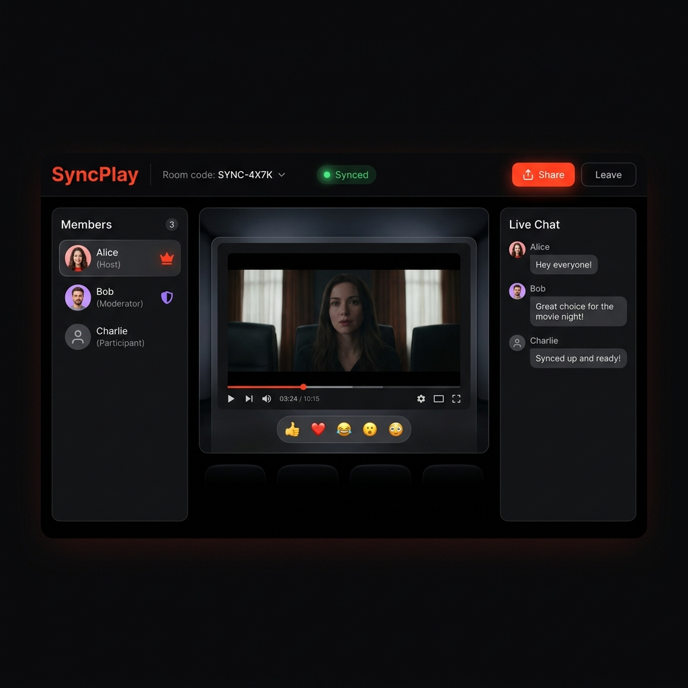
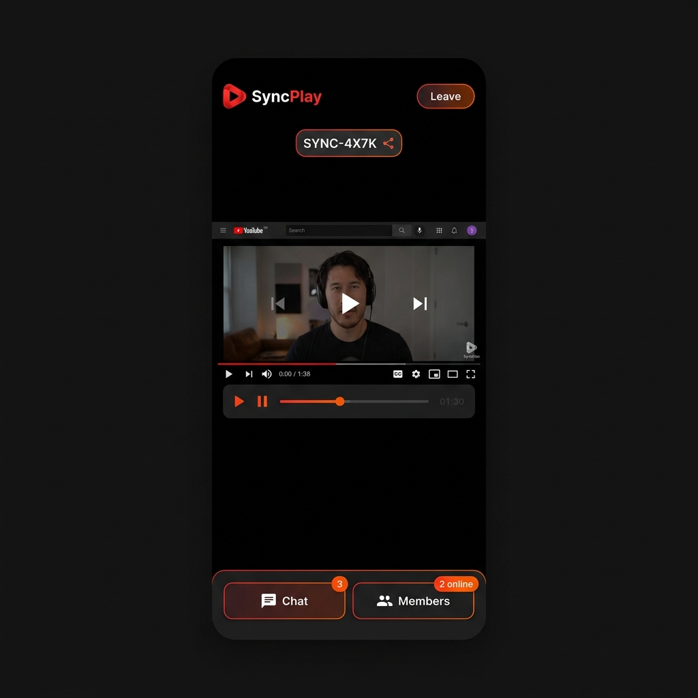

<div align="center">



# 🎬 SyncPlay — YouTube Watch Party

**Watch YouTube videos in perfect sync with friends. Real-time, role-based, and beautifully designed.**

[](https://sync-play-watch-party.onrender.com)
[](https://github.com/pulkit-phoenix31/SyncPlay---Watch-Party)
[](https://nodejs.org)
[](https://www.typescriptlang.org)
[](https://socket.io)

</div>

---

## 📸 Screenshots

<table>
  <tr>
    <td align="center" width="65%">
      <br/>
      <sub><b>🖥️ Desktop — Theater View with Sidebars</b></sub>
    </td>
    <td align="center" width="35%">
      <br/>
      <sub><b>📱 Mobile — Bottom Nav with Slide Drawers</b></sub>
    </td>
  </tr>
  
</table>

---

## ✨ Features

| Feature | Description |
|---|---|
| 🔴 **Real-time Sync** | Play, pause, and seek — all clients jump to the exact same timestamp instantly |
| 👑 **Role-Based Access** | Host · Moderator · Participant — each with enforced server-side permissions |
| 💬 **Live Chat** | In-room real-time chat with role badges and rate limiting |
| 🎭 **Emoji Reactions** | Floating animated reactions overlaid on the video canvas |
| 🔗 **Shareable Rooms** | One-click copy of room code or full join URL |
| 🔄 **Auto Host Promotion** | If Host disconnects, longest-tenured Moderator is promoted automatically |
| 💾 **Persistent State** | Room state, chat history, and participants survive server restarts |
| 📱 **Fully Responsive** | Desktop sidebars on large screens; slide-in drawers + bottom nav on mobile |

---

## 🏗️ Architecture Overview

SyncPlay uses a **WebSocket-first** real-time architecture, with REST as a lightweight fallback.

```
┌──────────────────────────────────────────────────────────────────┐
│                        CLIENT  (React + Vite)                    │
│                                                                  │
│  YouTubePlayer ◄──── useWatchParty hook ◄──── socket.ts         │
│  PlaybackControls          │                  (Socket.IO client) │
│  ChatPanel            REST polling                               │
│  ParticipantList      (fallback only)                            │
└──────────────────────────┬───────────────────────────────────────┘
                           │  WebSocket (Socket.IO)
                           │  Events: join_room · play · pause · seek
                           │          chat_message · user_left · sync_state
                           ▼
┌──────────────────────────────────────────────────────────────────┐
│                     SERVER  (Express + Socket.IO)                │
│                                                                  │
│  io.on('connection')                                             │
│      └─► registerSocketHandlers(io, socket)                      │
│              │                                                   │
│              ├─ ZOD schema validation (every event)              │
│              │                                                   │
│              ├─ PermissionService.check(role, action)            │
│              │   Enforces: Host-only, Moderator+Host, etc.       │
│              │                                                   │
│              ├─ RoomManager (Singleton)                          │
│              │   └─► Room (OOP class per room)                   │
│              │         ├── participants: Map<userId, Participant> │
│              │         ├── playState / currentTime / videoId     │
│              │         └── chatMessages[]                        │
│              │                                                   │
│              └─ io.to(room.id).emit(event, payload)              │
│                  Broadcasts to all members in the room           │
│                                                                  │
│  REST /api/rooms/:code  ◄─── Fallback polling endpoint          │
└──────────────────────────┬───────────────────────────────────────┘
                           │  Prisma ORM
                           ▼
┌──────────────────────────────────────────────────────────────────┐
│                   SQLite  (prisma/dev.db)                        │
│   Room · Participant · ChatMessage                               │
└──────────────────────────────────────────────────────────────────┘
```

### WebSocket Event Flow — Step by Step

1. **Client A (Host)** emits a Socket.IO event, e.g. `play` `{ roomCode, timestamp }`
2. **Server** receives it → **Zod** validates the payload shape
3. **PermissionService** checks the emitting socket's role against the action — unauthorized actions are rejected with an `error` event
4. **Room** class updates its in-memory state (`playState`, `currentTime`, `lastStateUpdate`)
5. **Prisma** asynchronously persists the new state to SQLite
6. **`io.to(room.id).emit('sync_state', ...)`** broadcasts the authoritative playback state to **every other client** in the room
7. **Client B, C, N** receive `sync_state` → `useWatchParty` hook updates React state → `YouTubePlayer` seeks/plays

### Key Design Decisions

- **In-memory first**: All hot-path state (`Room`, `Participant`) lives in a `Map` — no DB round-trips per event.
- **Singleton RoomManager**: One global instance maps `socketId → { room, userId }` for O(1) lookups on any event.
- **Drift correction**: Hosts/Moderators run a 5-second interval comparing local time vs. server `currentTime`; if drift > 1.2s, they self-correct silently.
- **Voluntary leave vs disconnect**: `leave_room` (button click) fully removes the participant. Socket `disconnect` (tab close) also removes immediately and broadcasts the clean member list.

---

## 🛠️ Tech Stack

### Frontend
| Library | Purpose |
|---|---|
| React 19 + TypeScript | UI framework |
| Vite 6 | Dev server & build tool |
| Tailwind CSS v4 | Utility-first styling |
| Motion (Framer Motion) | Animations & transitions |
| Socket.IO Client | Real-time WebSocket transport |
| YouTube IFrame API | Embedded video player |
| Lucide React | Icon set |

### Backend
| Library | Purpose |
|---|---|
| Node.js + Express | HTTP server |
| Socket.IO v4 | WebSocket server |
| Prisma ORM | Database client |
| SQLite (`dev.db`) | Persistent storage |
| Zod | Runtime schema validation |
| tsx | TypeScript execution |

---

## ⚙️ Local Setup

### Prerequisites
- **Node.js 18+**
- **npm** (or bun)

### 1. Clone the repository
```bash
git clone https://github.com/pulkit-phoenix31/SyncPlay---Watch-Party.git
cd SyncPlay---Watch-Party
```

### 2. Install dependencies
```bash
npm install
```

### 3. Set up the database
```bash
npx prisma db push
```
This creates `prisma/dev.db` with the Room, Participant, and ChatMessage tables.

### 4. (Optional) Environment variables
Create a `.env` file in the root:
```env
PORT=3000
NODE_ENV=development
```

### 5. Start the development server
```bash
npm run dev
```

Open **http://localhost:3000** — the Express server serves both the API/WebSocket and the Vite dev middleware from a single port.

---

## 📦 Building for Production

```bash
npm run build
# Outputs:
#   dist/index.html + assets  (Vite frontend build)
#   dist/server.cjs           (esbuild Node.js bundle)

npm run start
# Runs dist/server.cjs with NODE_ENV=production
```

---

## 🚀 Deployment

### Render (Recommended — WebSocket support)

> **Why Render?** Vercel's serverless functions don't support persistent WebSocket connections. Use Render, Railway, or Fly.io for Socket.IO apps.

1. Push your repository to GitHub
2. Go to [render.com](https://render.com) → **New Web Service**
3. Connect your GitHub repo
4. Configure:
   | Setting | Value |
   |---|---|
   | Build Command | `npm run build` |
   | Start Command | `npm run start` |
   | Environment | `Node` |
   | Environment Variable | `NODE_ENV=production` |
5. Click **Deploy**

🔴 **Live Demo**: [https://sync-play-watch-party.onrender.com](https://sync-play-watch-party.onrender.com)

### Railway
1. Create a new project from your GitHub repo
2. Set **Build Command**: `npm run build`
3. Set **Start Command**: `npm run start`
4. Add `NODE_ENV=production` as an environment variable

> **Note on Vercel**: The included `vercel.json` supports the REST API only. Socket.IO requires a persistent server — deploy the full app on Render/Railway.

---

## 🔐 Role & Permission System

Permissions are enforced **exclusively server-side** — the client UI reflects roles but cannot bypass checks.

| Action | Host | Moderator | Participant |
|---|:---:|:---:|:---:|
| Play / Pause | ✅ | ✅ | ❌ |
| Seek | ✅ | ✅ | ❌ |
| Change Video | ✅ | ✅ | ❌ |
| Assign Roles | ✅ | ❌ | ❌ |
| Remove Participant | ✅ | ❌ | ❌ |
| Transfer Host | ✅ | ❌ | ❌ |
| Send Chat | ✅ | ✅ | ✅ |
| Send Reactions | ✅ | ✅ | ✅ |

Unauthorized events are rejected server-side with:
```json
{ "message": "Unauthorized: Only Host or Moderator can seek", "code": "FORBIDDEN" }
```

---

## 🧪 Testing the App

Open the app in **3 browser tabs** and use these room codes:

- **Tab 1** → Create a room as `Alice` — becomes **Host**
- **Tab 2** → Join the same code as `Bob` — joins as **Participant**
- **Tab 3** → Join the same code as `Charlie` — joins as **Participant**

Test scenarios:
1. **Alice** presses Play → Bob and Charlie start playing simultaneously
2. **Alice** seeks to 2:30 → all tabs jump to 2:30
3. **Alice** promotes Bob to **Moderator** → Bob's controls unlock
4. **Alice** transfers Host to Charlie → Charlie becomes Host
5. Close **Charlie's** tab → after ~5s, Bob is auto-promoted to Host
6. Send chat messages, observe live delivery with role badges
7. Open on a mobile device — use the bottom nav to access Chat and Members

---

## ⚡ Scaling Beyond MVP

To support **100,000+ concurrent users** across **10,000+ rooms**:

1. **Redis Adapter** — Replace in-memory `RoomManager` with `@socket.io/redis-adapter` so multiple Node.js instances share pub/sub
2. **Horizontal Scaling** — Deploy stateless Node.js pods behind a load balancer (AWS ALB / Cloud Run) with **sticky sessions** for WebSocket stability
3. **PostgreSQL** — Replace SQLite with PostgreSQL (Supabase / AWS Aurora) + Prisma Accelerate for connection pooling
4. **CDN** — Serve the Vite static bundle via Cloudflare CDN; YouTube handles video CDN natively

---

## 📝 Known Limitations

| Limitation | Details |
|---|---|
| Browser Autoplay | Browsers block unmuted autoplay without user interaction — users must click once after joining |
| SQLite Single-File DB | Not suitable for multi-region clusters; replace with PostgreSQL for production scale |
| YouTube-Only | Only YouTube IFrame API is supported; no other video providers |

---

## 📂 Project Structure

```
SyncPlay/
├── server/
│   ├── index.ts              # Express + Socket.IO server entry
│   ├── api/
│   │   └── roomRoutes.ts     # REST fallback endpoints
│   ├── services/
│   │   ├── Room.ts           # Room OOP class (state, participants, chat)
│   │   ├── Participant.ts    # Participant model
│   │   ├── RoomManager.ts    # Singleton — manages all active rooms
│   │   └── PermissionService.ts  # Role-based action guards
│   ├── socket/
│   │   └── handlers.ts       # All Socket.IO event handlers
│   └── db.ts                 # Prisma client singleton
├── src/
│   ├── components/
│   │   ├── common/           # Navbar, Toast, etc.
│   │   ├── landing/          # Landing page (create/join room)
│   │   └── room/             # RoomView, YouTubePlayer, ChatPanel,
│   │                         # PlaybackControls, ParticipantList
│   ├── hooks/
│   │   └── useWatchParty.ts  # Central state hook (socket + REST)
│   ├── services/
│   │   └── socket.ts         # Socket.IO client wrapper
│   └── types/                # Shared TypeScript interfaces
├── prisma/
│   └── schema.prisma         # Room · Participant · ChatMessage models
├── .github/assets/           # README screenshots
└── vercel.json               # Vercel rewrite rules (REST only)
```

---

<div align="center">

Made with ❤️ by [pulkit-phoenix31](https://github.com/pulkit-phoenix31)

</div>
